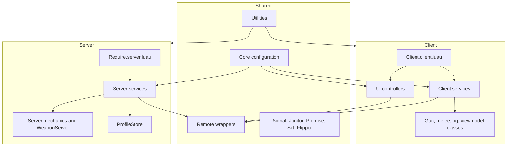
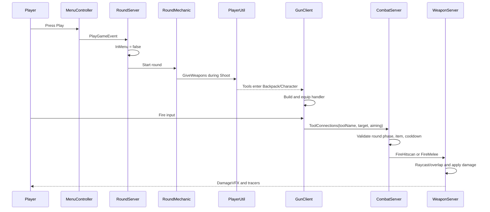

# Architecture

Color Clash uses convention-based client and server bootstraps, shared configuration, wrapper modules for remotes, and attribute-driven state synchronization.

## Runtime layers



## Bootstrap convention

The client bootstrap is `src/StarterPlayer/StarterPlayerScripts/Client/Client.client.luau`.

- Every folder under `ReplicatedStorage.Shared.Services` is treated as a service.
- A folder named `GunService` must contain a module named `GunClient`.
- Every ModuleScript directly under `ReplicatedStorage.Shared.UIControllers` is loaded as a UI controller.
- The bootstrap calls every `Init()` first, then every optional `Start()`.

The server bootstrap is `src/ServerScriptService/Server/Require/Require.server.luau`.

- Every folder under `Server.Services` is treated as a service.
- A folder named `RoundService` must contain `RoundServer`.
- The bootstrap calls all `Init()` methods, then all optional `Start()` methods.

`Instance:GetChildren()` order is not guaranteed. A module may assume all sibling modules can be required, but it must not assume another sibling’s `Init()` has already run. Use explicit waits, signals, profile waits, or a `Start()` phase when sequencing is required.

## Responsibilities

| Layer | Owns |
| --- | --- |
| Client service | Input routing, local simulation/presentation, remote requests |
| UI controller | Existing GUI hierarchy, UI state, visual feedback |
| Shared class | Stateful reusable client controller or server mechanic |
| Core config | Tunable values and content declarations used by multiple systems |
| Remote wrapper | Remote creation on server and lookup on both sides |
| Server service | Remote validation, persistence, authoritative state changes |
| Server class/mechanic | Reusable domain logic called by server services |

## Primary gameplay flow



## State communication

The game uses player and Workspace attributes for frequently observed state and remotes for actions or payloads. Important attributes are documented in [Runtime State and Lifecycle](Runtime-State-and-Lifecycle). Remote signatures are documented in [Networking and Security](Networking-and-Security).

## Package policy

Vendored third-party packages live under `src/ReplicatedStorage/Shared/Packages/_Index` and server ProfileStore lives under `src/ServerScriptService/Server/ServerPackages/_Index`. Do not edit vendored package internals for game features. Wrap or upgrade the dependency instead.

## Adding a service

For a client service named `ExampleService`, create:

```text
src/ReplicatedStorage/Shared/Services/ExampleService/
├── ExampleClient.luau
└── init.meta.json
```

For a server service:

```text
src/ServerScriptService/Server/Services/ExampleService/
├── ExampleServer.luau
└── init.meta.json
```

Return a table with `Init()` and an optional `Start()`. Keep `Init()` idempotent because duplicate event connections are difficult to diagnose during respawn and Studio reload workflows.
