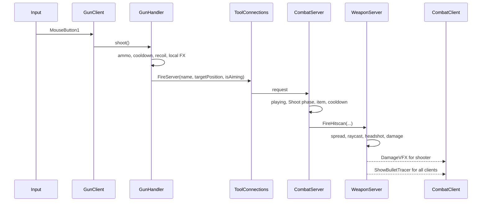

# Combat and Weapons

## Authoritative pipeline

`GunClient` is the single weapon input and controller factory.

- A Tool with an `Items` entry containing `MaxAmmo` receives a `GunHandler`.
- A Tool with an `Items` entry without `MaxAmmo` receives a `MeleeHandler`.
- Mouse 1 calls `shoot()` or `Swing()`.
- Mouse 2 starts/stops ADS when supported.
- `R` reloads when supported.

`CombatClient` is not a duplicate firing pipeline. It presents damage numbers, hit/kill feedback, blood effects, remote tracers, camera sway, local visibility, and non-rig camera/body behavior.

## Gun fire flow

## Client gun behavior

`GunHandler` owns per-Tool local ammo, semi/automatic cadence, ADS, reload, crosshair bloom, movement animations, camera effects, muzzle flash, shell ejection, and remote requests.

- Semi-automatic weapons use `Cooldown` as a local lockout.
- Automatic weapons run on `Heartbeat` until input ends, ammo empties, reload starts, or the Tool is unequipped.
- Empty fire plays `DryFire` and begins reload.
- `ReloadPerShell` loops one shell per `ReloadTime`; other guns refill after one reload duration.
- ADS sets `AimFOV`, enables the light black vignette, applies a `0.55` movement multiplier, and uses the item’s spread multiplier server-side.

## Server gun behavior

`CombatServer` accepts `ToolConnections(toolName, mousePos, isAiming)` only when:

- `player.IsPlaying` is true;
- `Workspace.ArenaPhase == "Shoot"`;
- `Items[toolName]` exists;
- the server cooldown for that player and weapon has elapsed.

`WeaponServer.FireHitscan()` then verifies the named Tool is equipped in the character and has a handle. It plays server-visible animation/audio, obtains the muzzle origin, applies spread and range, raycasts while skipping repair/debris/base geometry, doubles damage for a part named exactly `Head`, and broadcasts tracers.

The server currently does not maintain authoritative ammunition. See [Known Limitations](Known-Limitations) before changing competitive or anti-cheat expectations.

## Melee flow

`MeleeHandler` selects the migrated `Animations.Swing` ID using `Humanoid.RigType.Name`, plays the real Humanoid animation, plays a type-specific swing sound, adds a small camera recoil cue, optionally vibrates a controller, and sends the same `ToolConnections` request.

`WeaponServer.FireMelee()` verifies the equipped Tool and searches `Workspace:GetPartBoundsInRadius(handle.Position, 3.5, overlapParams)`. Each character is damaged at most once per swing. The server also plays the swing animation for replication.

Melee sound fallback is name-based:

- names containing `Axe` use the axe sound;
- names containing `Bat` use the bat sound;
- all others use the knife/default sound.

## Damage, elimination, and rewards

`WeaponServer.ProcessDamage()`:

1. rejects invalid/dead Humanoids;
2. rejects same-team damage when friendly fire is off;
3. updates shot-taken and shot-landed quest stats for participating players;
4. applies nonlethal Humanoid damage;
5. on lethal damage, retires the player from the round, awards kill currency/stats, ragdolls and returns the victim to lobby, sends death and kill-feed payloads, and starts spectating after three seconds.

NPC Models with Humanoids can also receive damage and produce kill rewards, but do not participate in player placement logic.

## Weapon schema

Every `Items` key is the canonical Tool name.

Common melee fields:

| Field | Meaning |
| --- | --- |
| `Damage` | Damage per successful server overlap |
| `Cooldown` | Minimum time between accepted swings |
| `Shake.Intensity`, `Shake.Decay` | Presentation tuning; not all declared decay values are consumed |
| `Animations.Swing.R6/R15` | Full `rbxassetid://` strings |
| `Animations.Idle/Walk/Sprint` | Full animation URI strings |

Additional ranged fields:

| Field | Meaning |
| --- | --- |
| `Range` | Server ray length |
| `MaxAmmo` | Classifies the item as a gun and sets local magazine size |
| `ReloadTime` | Full-mag duration or per-shell duration |
| `ReloadPerShell` | Enables shell-by-shell reload |
| `Spread` | Server jitter scale |
| `Pellets` | Rays per shot; defaults to 1 |
| `AutoFire` | Hold-to-fire behavior |
| `Recoil.Pitch/Yaw` | Permanent and visual recoil inputs |
| `Aim.FOV` | ADS target FOV |
| `Aim.SpreadMultiplier` | Server spread multiplier while aiming |
| `Animations.Shoot/Reload/Idle/Walk/Sprint` | Full animation URI strings |

## Current weapon roster

Ranged: Pistol, Sniper, AR, SMG, Scar, Shotgun.

Melee: Wooden Knife, Knife, Metal Knife, Wooden Axe, Axe, Metal Axe, Wooden Bat, Metal Bat, Spiked Bat.

For exact live numbers, use `Items.luau`; do not duplicate tuning constants into gameplay code. Follow [Content Authoring](Content-Authoring) when adding a weapon.
