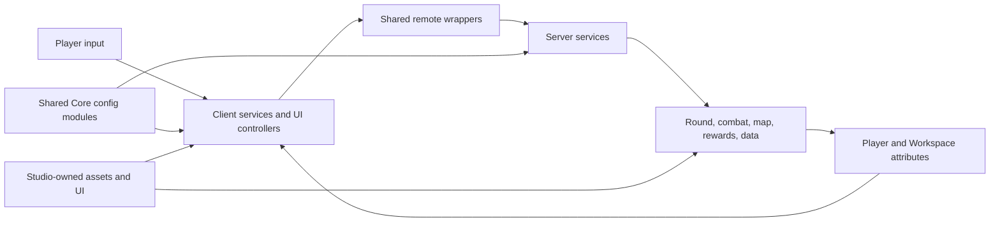

# Color Clash Developer Wiki

Color Clash is a round-based Roblox arena shooter built around fast movement, color-survival phases, hitscan guns, melee weapons, free-for-all and team modes, progression, and a menu-driven lobby.

This wiki documents the repository at commit `e45d841` on 16 August 2026. It is written for developers who need to understand the game, safely change it, or add a feature without reverse-engineering the entire place first.

## Start here

1. Read [Getting Started](Getting-Started) to open the place and connect Rojo.
2. Read [Architecture](Architecture) and [Runtime State and Lifecycle](Runtime-State-and-Lifecycle) before changing a system.
3. Open the page for the system you are editing.
4. Follow [Feature Recipes](Feature-Recipes) for common additions.
5. Use [Testing, Debugging, and Release](Testing-Debugging-and-Release) before handing off changes.

## System map

## Core documentation

| Area | Page |
| --- | --- |
| Setup and Rojo | [Getting Started](Getting-Started) |
| Client/server design | [Architecture](Architecture) |
| Repository and Studio tree | [Project Layout](Project-Layout) |
| Attributes and lifecycle | [Runtime State and Lifecycle](Runtime-State-and-Lifecycle) |
| Round state machine and map generation | [Rounds and Maps](Rounds-and-Maps) |
| Guns, melee, damage, and equipment | [Combat and Weapons](Combat-and-Weapons) |
| First-person arms, camera, ADS, recoil, and effects | [Viewmodel, Camera, and FX](Viewmodel-Camera-and-FX) |
| Sprint, slide, wall movement, vault, and push | [Movement and Push](Movement-and-Push) |
| Profiles, cash, inventory, and shop | [Data, Persistence, and Economy](Data-Persistence-and-Economy) |
| Quests and daily rewards | [Quests and Daily Rewards](Quests-and-Daily-Rewards) |
| HUD, menu, settings, audio, and GUI contracts | [UI, Settings, and Audio](UI-Settings-and-Audio) |
| Remote contracts and trust boundaries | [Networking and Security](Networking-and-Security) |
| Adding weapons, maps, sounds, and settings | [Content Authoring](Content-Authoring) |
| Common implementation procedures | [Feature Recipes](Feature-Recipes) |
| Test matrix and release process | [Testing, Debugging, and Release](Testing-Debugging-and-Release) |
| Public module APIs | [Module Reference](Module-Reference) |
| Current technical gaps | [Known Limitations](Known-Limitations) |

## Architectural rules

- Server code owns persistent data, purchases, rewards, round outcomes, hit damage, and authoritative push results.
- Clients own input, camera, first-person presentation, UI, local movement feel, and cosmetic effects.
- Shared configuration under `src/ReplicatedStorage/Shared/Modules/Core` is the preferred place for tunable data.
- Remote instances are created by server-side remote wrapper modules. Callers require wrappers instead of finding remotes by name.
- Service bootstrap order is not guaranteed. `Init()` must not depend on sibling iteration order.
- The current weapon input path is `GunClient`, which selects `GunHandler` for ranged weapons and `MeleeHandler` for melee.
- Weapon names are cross-system identifiers. An item name must agree across `Items`, `ShopConfig`, saved inventory, equipped slots, `Shared.Assets.Weapons`, and optional `WeaponViewmodelData`.
- Rojo preserves Studio instances not represented on disk. Do not assume the filesystem contains every map, GUI, sound, tool, or world asset.

## Keeping this wiki current

Documentation is part of the feature definition. A change is incomplete if it alters a remote signature, attribute, configuration schema, required Studio instance, content-authoring process, or public module API without updating the relevant page and [Module Reference](Module-Reference).
