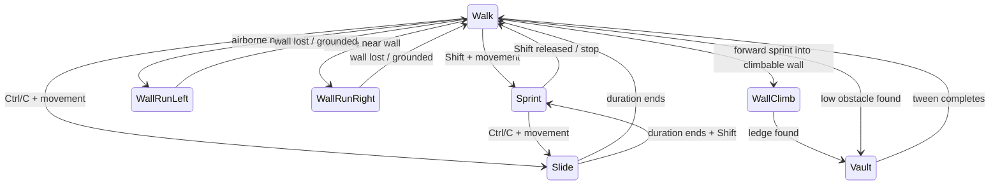

# Movement and Push

## Ownership

`MovementClient` owns movement feel and most state transitions. It updates `Humanoid.WalkSpeed`, applies local physics movers, plays movement animations, writes `MovementState`, and reports state/speed to `MovementServer`.

`MovementServer` clamps requested speed to the maximum of configured sprint, wall-run, and air-speed ceilings. It does not independently derive every movement state.

## Controls

| Input | Action |
| --- | --- |
| `LeftShift` | Hold sprint |
| `LeftControl` or `C` | Slide while moving and active |
| Jump | Normal jump, double jump, wall jump, climb jump-off, or slide jump depending on state |
| Mouse 1/touch | Push request while participating; weapon fire also uses Mouse 1 during Shoot |

Input is rejected in the menu or while ragdolled. Slide additionally requires `IsPlaying == true`.

## Movement states

The camera and first-person rig treat `WallRun`, `Slide`, `WallClimb`, and `Vault` as rotation-owning states.

## Current tuning

All primary values live in `MovementConfig`.

- Walk speed: 24
- Sprint speed: 40
- Wall-run speed: 55
- Double-jump vertical power: 29
- Air gravity scale: 0.4
- Air momentum retention: 1
- Air speed range: 40–110
- Slide cooldown: 0.25 s
- Slide duration: 1 s
- Slide base/sprint power: 100/130

Wall-run, wall-climb, vault, and animation settings are also centralized there. Use the config instead of adding local constants unless a value is strictly implementation-specific.

## Air momentum

When the character becomes airborne, `MovementClient` can preserve horizontal speed within the configured minimum/maximum. Grounding clears the override. A `VectorForce` counteracts part of Workspace gravity for normal air movement and uses a different scale during wall run.

Landing tracks the most negative fall speed and calls `FXUtil.LandImpact()` when the configured threshold is exceeded.

## Slide

Slide creates a `LinearVelocity` on the root, starts at base or sprint power, then tweens toward walk/sprint speed. Jumping during slide removes the mover while preserving horizontal velocity into air momentum. Leaving play destroys the mover and restores `Walk`.

## Wall run, climb, and vault

- Wall detection raycasts at multiple root heights and requires a mostly vertical normal.
- Wall run requires sufficient height above the floor and sufficient wall height.
- Wall jump preserves wall-parallel velocity and adds configurable outward/upward force.
- Forward sprint checks obstacles for vault height or wall-climb height.
- Vault temporarily anchors and tweens the root over the obstacle, then restores velocity.
- Wall climb uses a vertical `LinearVelocity` for a short configured duration and can transition to vault when the ledge clears.

## Visual movement feedback

`MovementClient` adds:

- camera roll for strafing, slide, and wall run;
- root-joint lean from local velocity;
- movement AnimationTracks from `MovementConfig.Animations`;
- speed trail, double-jump ring, slide sound, and landing effects through `FXUtil`.

`SettingsController` can add Dynamic FOV based on flat speed. ADS `AimFOV` takes precedence.

## Push

`PushClient` sends `PushRequest` on unconsumed Mouse 1/touch when the player is active, outside the menu, not ragdolled, and past the local cooldown.

`PushServer` repeats key validation and searches active players. A target is eligible when:

- it is another active player;
- it is alive and not ragdolled;
- it is not a teammate in a team mode;
- it is within `RoundConfig.Push.Radius`;
- its flat direction passes `MinDot` against the pusher’s facing direction.

The server applies a temporary `LinearVelocity` with horizontal force and lift. Current values are cooldown 0.6 s, radius 12, force 90, lift 25, minimum dot 0.35, duration 0.2 s, and max per-axis force 100000.

The server currently does not restrict push to `ArenaPhase == "Push"`; it is available in any active phase if other input plumbing allows the request. Treat that as current behavior when designing phase-specific changes.

## Extension rules

- Add a new state name to movement logic and animation config together.
- Decide whether the state owns character rotation and add it to the rig’s rotation-owning list if needed.
- Clean every temporary mover, constraint, anchor, animation, and camera offset on death, ragdoll, `IsPlaying` loss, and respawn.
- Validate any gameplay-significant client request again on the server.
- Test R6 and R15 because root-joint and floor-distance paths differ.
