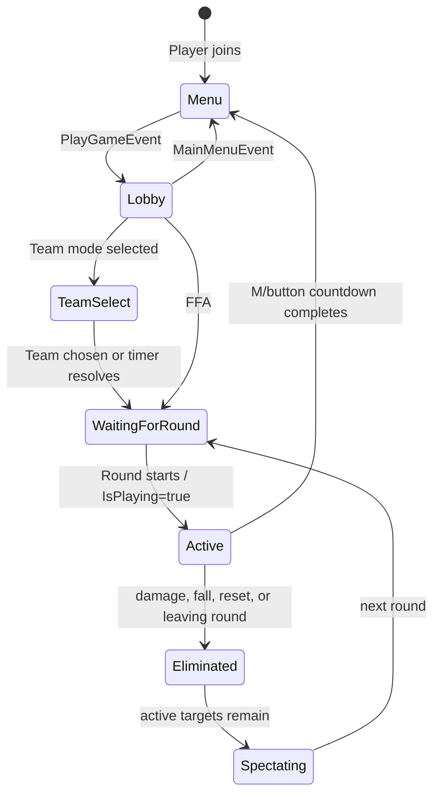

# Runtime State and Lifecycle

Most cross-system state is expressed through attributes. Before adding another Boolean or remote, check whether an existing lifecycle attribute already represents the condition.

## Player attributes

| Attribute | Type | Owner | Meaning |
| --- | --- | --- | --- |
| `InMenu` | Boolean | `RoundServer` | `true` while the player is in the main menu; gameplay clients generally require `false` |
| `IsPlaying` | Boolean | `RoundServer` and elimination logic | Player is alive and participating in the active round |
| `Team` | string or nil | `RoundServer` | Selected team name during a team round |
| `Kills` | number | `RewardManager`/`RoundServer` | Kills in the current round |
| `RoundCash` | number | `RewardManager`/`RoundServer` | Kill cash earned in the current round |
| `MovementState` | string | `MovementClient` | `Walk`, `Sprint`, `Slide`, `WallRunLeft`, `WallRunRight`, `WallClimb`, or `Vault` |
| `GunCameraActive` | Boolean or nil | `FirstPersonRig` | Scriptable first-person combat camera currently owns local camera behavior |
| `AimFOV` | number or nil | `CameraFX` | Desired ADS FOV; consumed by `SettingsController` |
| `AimSlowMultiplier` | number or nil | weapon handler | Movement-speed multiplier while aiming |
| `AimPitch` | number | `CombatServer` | Last validated aim pitch replicated for other clients |

## Character attributes

| Attribute | Type | Meaning |
| --- | --- | --- |
| `Ragdolled` | Boolean | Ragdoll constraints are active and normal control is suspended |
| `DeathRetired` | Boolean | Character death/removal has already been processed for the round |
| `OldWalkSpeed` | number | Pre-ragdoll speed snapshot |
| `OldJumpPower` | number | Pre-ragdoll jump snapshot |

Joint-related attributes such as `RigOriginalC0`, `RigPoseLocked`, `PoseOriginalC0`, `OriginalC0`, `TiltX`, and `TiltZ` are implementation state for camera, pose, and movement systems. Do not repurpose them for gameplay state.

## Workspace attributes

| Attribute | Values | Owner |
| --- | --- | --- |
| `RoundMode` | `FFA`, `Teams` | `RoundServer` |
| `ArenaPhase` | `Push`, `Shoot`, or nil | `RoundMechanic` |

Generated map cells carry `GridRow`, `GridCol`, and `GridColor` attributes.

## Player lifecycle

`InMenu` and `IsPlaying` are independent. A player can be outside the menu but not actively alive, which is the lobby/spectator state. Code that tests only one of these attributes may activate in the wrong state.

## Round lifecycle

The server loop transitions through:

1. `WaitingForPlayers`
2. `PostRound`
3. `Voting`
4. optional `TeamSelect`
5. `InGame`
6. cleanup, then back to `PostRound`

During `InGame`, `RoundMechanic` alternates arena phases:

1. `Push`: weapons removed; push input remains available.
2. Color announcement: first announcement is five seconds; subsequent pre-color push delay is configured as zero.
3. Nonmatching tiles hide.
4. `Shoot`: equipped weapons are granted; hidden phase timer runs.
5. Tiles restore and the cycle repeats with ramped timings.

## Camera lifecycle

`FirstPersonController` obtains singleton instances of `FirstPersonRig` and `Viewmodel`.

- `IsPlaying = true`: enable the first-person rig and shared viewmodel.
- `IsPlaying ~= true`: disable the rig and destroy the shared viewmodel.
- `CharacterAdded`: clear the old shared viewmodel, then resynchronize.
- ragdoll, missing root, or zero health: the rig releases Scriptable camera behavior until the character is valid.
- menu camera is separately owned by `MenuController` using `Workspace.Cam`.

Any new camera system must compose with these owners. Do not bind another always-on camera writer at an equal or higher render priority without an explicit ownership rule.

## Equipment lifecycle

`PlayerUtil.GiveWeapons()` clones the profile’s equipped `Main` and `Melee` Tool templates into the Backpack during `Shoot`. `GunClient` watches the character and Backpack, constructs one controller per Tool, and calls `Equip()` when the Tool moves into the character. Moving or destroying the Tool calls `Unequip()`/`Destroy()`.

Tools are removed during `Push`, elimination, menu return, and round cleanup. Controller code must tolerate Tool destruction at any point, including during reload or automatic fire.
